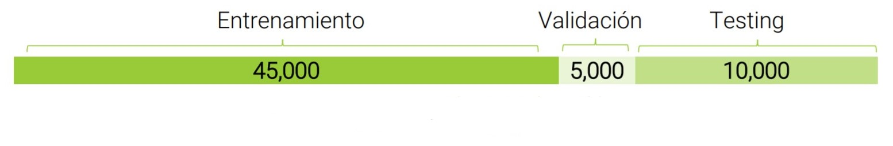
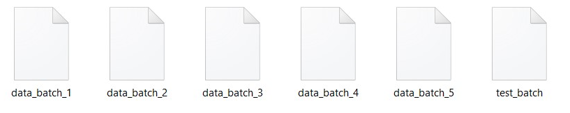
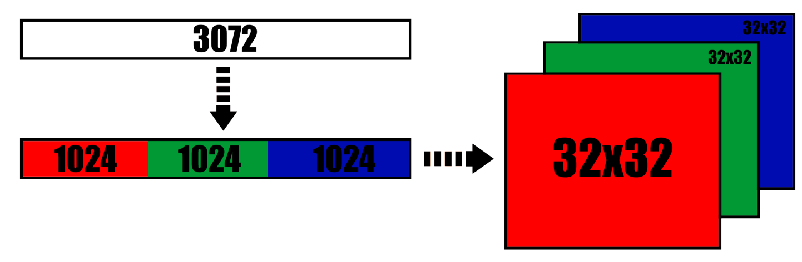
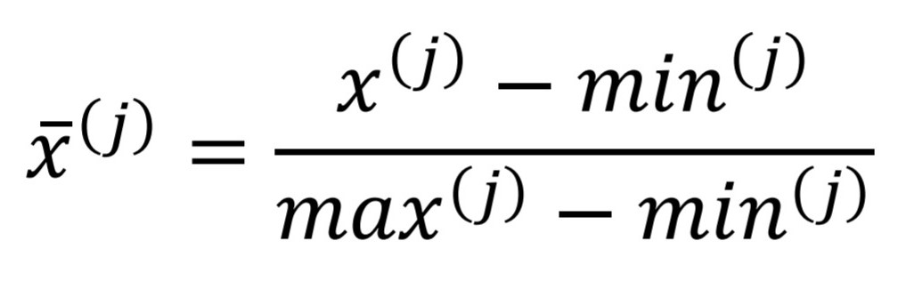
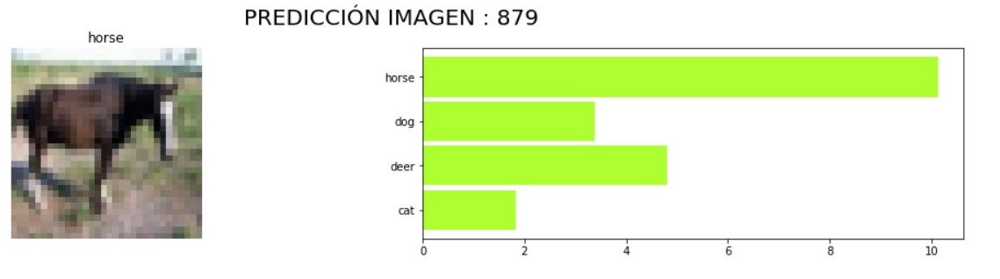
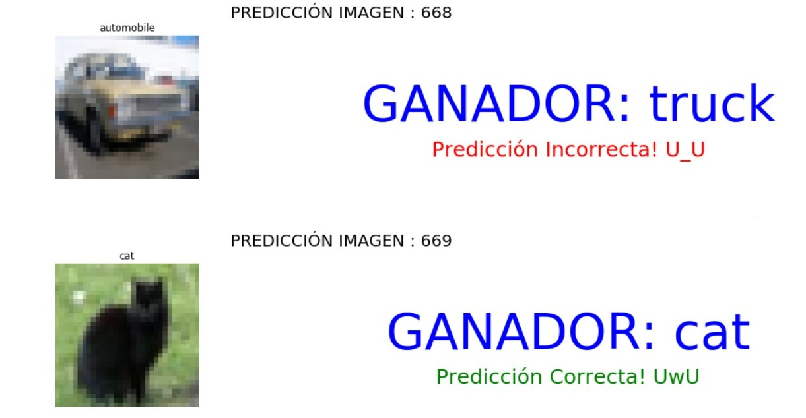

# Image Classification with CIFAR-10 dataset
This notebooks have the purpose to use Convolutional Neural Network (TensorFlow2) and Conventionals Models like Random Forest, Logistic Regression, KNN and SVM to classify images from the [CIFAR-10](https://www.cs.toronto.edu/~kriz/cifar.html) DATA SET.

This project was done together with my friend [Francisca Hernandez Piña](https://github.com/panchyh97).

# Abstract
CIFAR-10 is a computer vision data set used for object recognition.
This dataset contains 60,000 32x32 pixel color images distributed in 10 classes of objects, with 6,000 images per class, these are:
* 1 - airplane										
* 2 - automobile										
* 3 - bird										
* 4 - cat										
* 5 - deer										
* 6 - dog										
* 7 - frog										
* 8 - horse										
* 9 - ship										
* 10 - truck

Of this total of 60,000 images, 50,000 are for training and 10,000 for testing. For this specific project, 10% of training images were removed to validate, leaving the data distribution as follows:



The purpose of this project is to recognize an image and predict which of the 10 CIFAR-10 classes it belongs to.

# Models
The following models are used in this project:
* CNN						
* PCA
* RANDOM FOREST
* LOGISTIC REGRESSION							
* KNN					
* SVM

# The Data Set
The data to be analyzed is distributed in 6 files called batches, each one has a set of 10,000 images, one of these being used as model testing information. Below is an image with the distribution:



The dimension of a color image is 32x32 pixels and is made up of 3 channels (Red, Green, Blue = RGB) for each pixel present in them. The values for each channel range from 0 to 255, allowing each pixel in the image to be colored. Considering the above, you have 32 x 32 x 3 = 3072 data per image.





Due to the composition of the data to be used, it is not necessary to carry out a comprehensive data cleaning as was done during the course. In this case, a normalization is only carried out by applying the formula:




Normalization is done so that all the images have a common scale, in addition, it allows the models to work as a normal distribution.

# Results
For this specific project, the most relevant model metric is precision, since it only matters if the model is accurate when identifying an image.

The results obtained for each of the mentioned models were:
* CNN	: 0.7088
* RANDOM FOREST : 0.3908
* LOGISTIC REGRESSION : 0.1453
* KNN	: 0.4019
* SVM : 0.4833

# Conclusion
Finally, when we compare the results of the metrics of each model, it follows that the best applied model is convolutional neural networks. (Backpropagation algorithm for the win :D)

# Extras




``` MIT License ```
```Copyright (c) 2020 FILLIKENESUCN```
